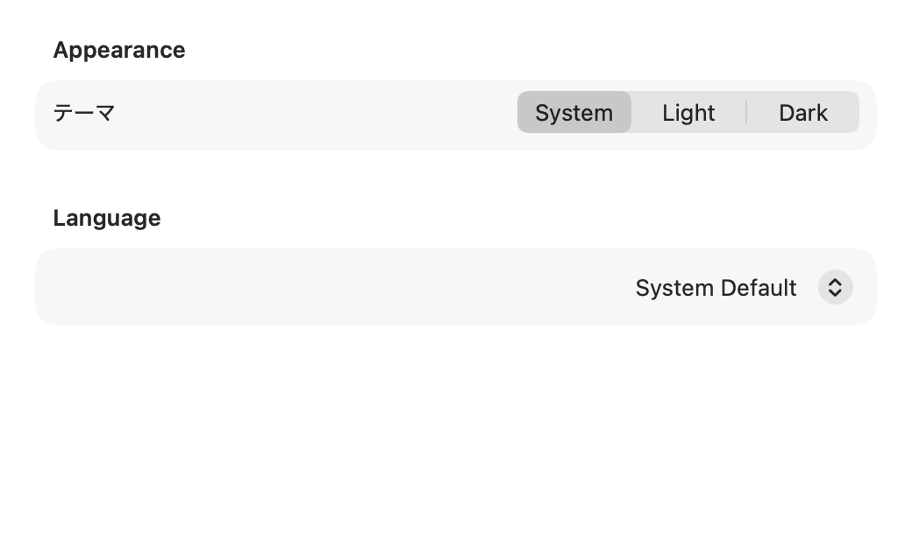
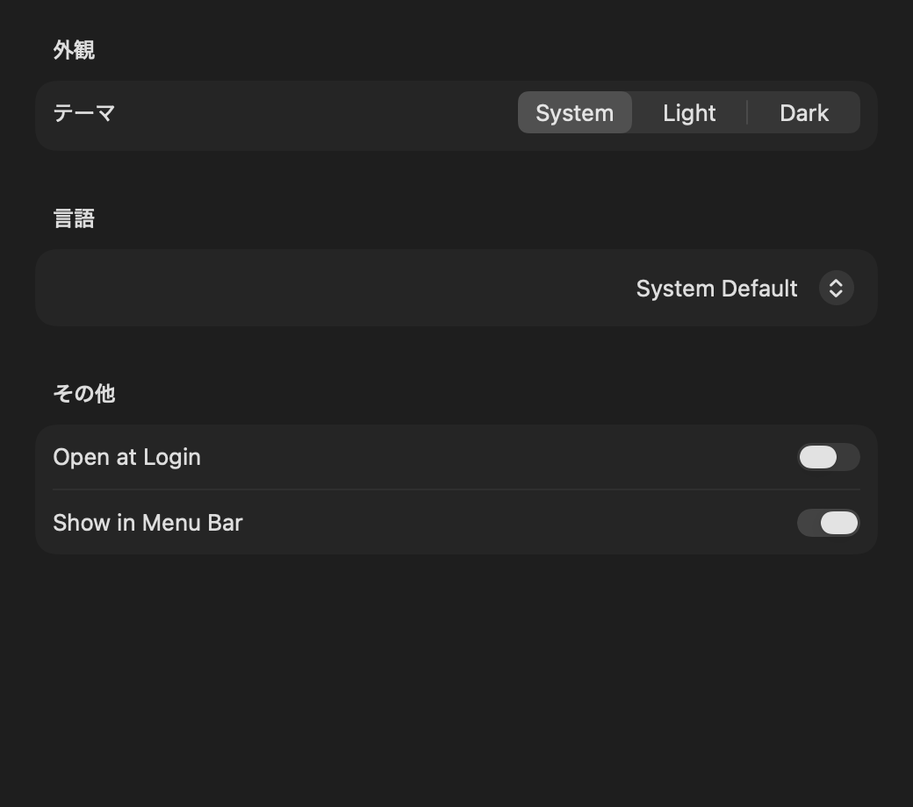
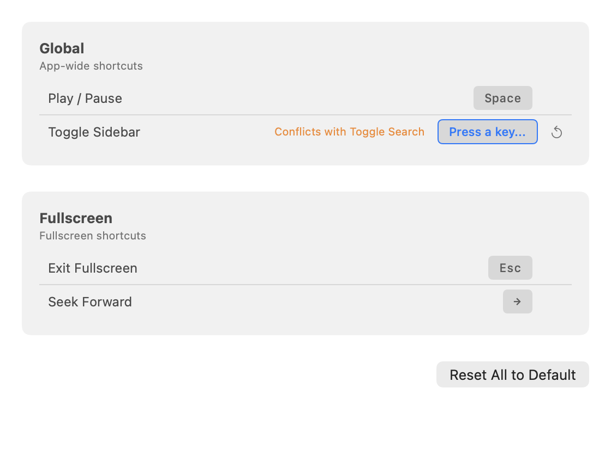
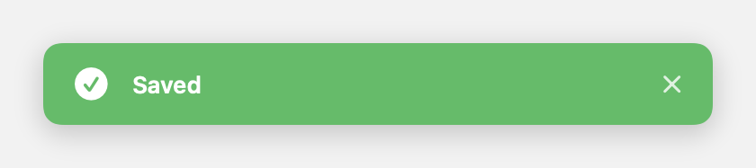
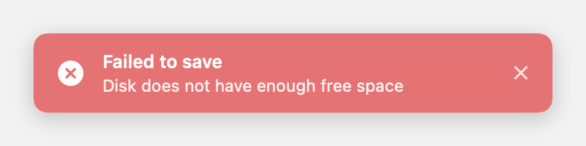
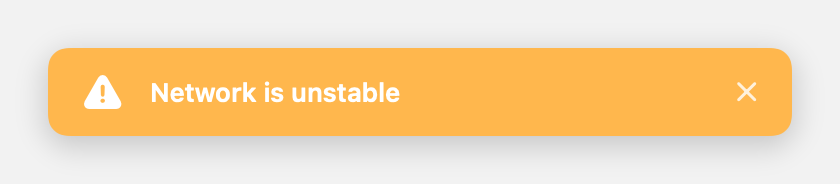
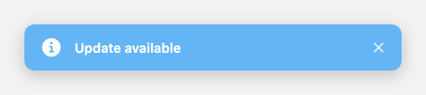
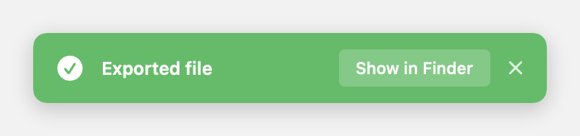

# StandardAppComponents

SwiftUI **macOS アプリ専用** の Personal SPM。

Settings ウィンドウ枠、表示言語切替、ログイン時起動トグル、メニューバー表示トグル、ウィンドウ挙動、外観適用、Toast など、複数アプリで繰り返し出てくる薄い macOS 定型処理を集約する。

このパッケージは汎用デザインシステムではない。アプリ固有の状態管理、永続化、文言、メニュー構成、ウィンドウルーティング、業務ロジックは consumer アプリ側に残す。

## 対象

| 対象 | 対象外 |
|---|---|
| Swift / SwiftUI macOS アプリ | iOS / watchOS アプリ |
| 複数 macOS アプリで同じ形になる AppKit / SwiftUI の薄い wrapper | クロスプラットフォーム抽象 |
| Settings ウィンドウの規約と共通挙動 | アプリ固有 Settings タブ / 設定値永続化 |
| 共通ラベルを持つ小さな UI 部品 | メニューバー常駐 agent / status item lifecycle |
| Toast の queue / 表示 / manager protocol | Alert / Sheet が必要な確認・致命的エラー |

`Package.swift` の `platforms: [.macOS(.v14)]` は意図的に固定している。`NSWindow`, `NSApp`, `NSVisualEffectView`, `SMAppService.mainApp` など AppKit / ServiceManagement 前提の API を含む。

## ドキュメント

| 目的 | ドキュメント |
|---|---|
| 公開 API ごとの「lib が提供するもの / consumer が実装するもの」を確認する | [docs/api-boundaries.md](docs/api-boundaries.md) |
| Settings ウィンドウと General タブ部品の詳細 | [docs/settings.md](docs/settings.md) |
| Toast のモデル / manager / 表示コンテナの詳細 | [docs/toast.md](docs/toast.md) |
| コピペ元の最小サンプル | [Examples/README.md](Examples/README.md) |

## 代表 API

| 領域 | API |
|---|---|
| Settings | `SettingsWindow`, `GeneralTabContract`, `SettingsWindowConstants`, `NotImplementedSlot` |
| Settings 挙動 | `View.standardSettingsBehaviors()`, `View.autoSaveWindowFrame(name:)`, `WindowBackgroundView` |
| 外観 | `StandardAppearanceMode`, `View.applyAppAppearance(_:)` |
| 言語 | `LanguageSection`, `LanguageOption` |
| ショートカット設定 | `ShortcutSettingsTab`, `StandardShortcutGroup`, `StandardShortcutItem` |
| ログイン時起動 | `LaunchAtLoginService`, `LaunchAtLoginToggle` |
| メニューバー表示 | `MenuBarVisibilityToggle` |
| Toast | `Toast`, `ToastText`, `ToastAction`, `ToastManaging`, `ToastManager`, `ToastView`, `ToastContainerView`, `View.standardToastContainer(_:)` |
| ローカライズ検証 | `StandardAppComponentsLocalization.validateRequiredKeys()` |

## 明示的に提供しないもの

- `AboutContract` / 独自 About ウィンドウ
- `MenuBarAgent` / `MenuBarContract`
- Sparkle setup helper
- Global shortcut registrar
- Notification permission flow
- アプリ設定値の永続化層
- デザイントークン / 共通ボタン / 空状態などの広い UI kit

理由と境界は [docs/api-boundaries.md](docs/api-boundaries.md) にまとめている。

## スクリーンショット

### Settings ウィンドウ

| Light | Dark |
|---|---|
|  |  |

SwiftUI の offscreen screenshot generator では NSWindow chrome は完全には再現されない。実アプリではより macOS ネイティブな見た目になる。

### ショートカット設定



### Toast

| Style | Screenshot |
|---|---|
| Success |  |
| Error |  |
| Warning |  |
| Info |  |
| With action |  |

スクショ再生成:

```bash
bin/generate-screenshots
```

## ビルド

```bash
swift build
swift test
bin/generate-screenshots
```

## 運用

このリポジトリ固有の作業ルールは [CLAUDE.md](CLAUDE.md) を参照。

重要: この package で commit したら `origin/master` へ push する。consumer アプリは現状 `branch: master` で参照しているため、ローカル commit のままだと取り込めない。
